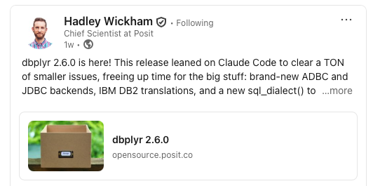
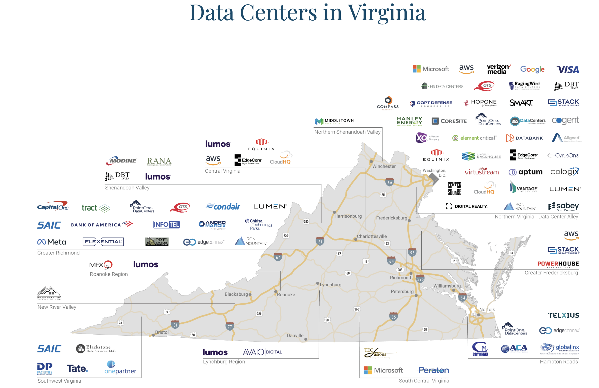
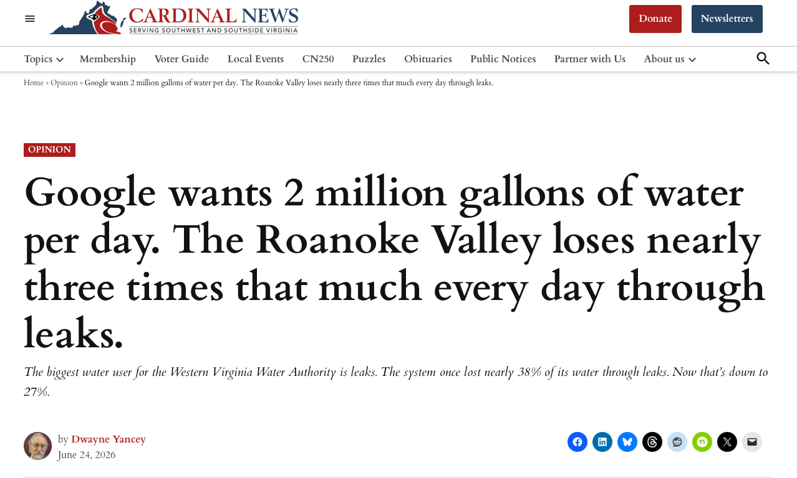

## What is this thing?

- Large Language Models (LLMs) are at the heart of tools like ChatGPT, Claude, and Gemini

- They are **not** search engines, databases, or calculators

- They are **next-word predictors** trained on massive amounts of text

## How does an LLM work?

The core mechanism:

- Given a sequence of words (tokens), the model assigns a **probability** to every possible next word
- It samples from that distribution to generate text — one token at a time
- Repeat until the response is complete

$~$

```         
P("forest" | "The carbon is stored in the ___") = 0.62
P("river"  | "The carbon is stored in the ___") = 0.20
P("city"   | "The carbon is stored in the ___") = 0.10
```

## A bit more detail

[LLM video (8 minutes)](https://www.youtube.com/watch?v=LPZh9BOjkQs)

## Training: where the knowledge comes from {.smaller}

**Pre-training**

- Model reads billions of words from the internet, books, and code
- Learns which words follow which other words across countless contexts

$~$

**Fine-tuning with RLHF** (Re-enforcement Learning with Human Feedback)

- Human raters score model outputs
- Model is rewarded for responses humans prefer
- Result: fluent, confident, *helpful-sounding* text

## The "professional BS artist" problem

> Reinforcement learning optimizes for human approval — not for truth.

$~$

- The model learns to sound right

- Sounding right ≠ being right

- This is the root cause of **hallucinations**

## Hallucinations {.smaller}

LLMs are **plausibility generators**, not fact databases

$~$

They confidently produce incorrect information, including:

- Fabricated citations and studies
- Invented statistics
- Nonexistent court cases, laws, and events

$~$

::: callout-warning
In 2023, attorneys submitted a legal brief citing six AI-generated court cases. None existed. The court sanctioned the lawyers.
:::

## Prompting {.smaller}

How you write your prompt has an enormous effect on output quality

::::: columns
::: {.column width="50%"}
**Four levers:**

- **Specificity** — be precise about what you want
- **Context** — give background; the model has no memory of you
- **Persona** — assign a role: *"You are an ecologist…"*
- **Constraints** — set limits on format, length, or scope
:::

::: {.column width="50%"}
**Example:**

```         
You are an environmental data scientists with an experience in R. You use tidyverse function when appropriate. Create a plot in R that displays the CO2 data from the Vostok Ice core and the Keeling curve on the same plot. Make sure that the plot as the earliest time period on the left of the x-axis. Label axes and provide a useful title.
```
:::
:::::

## Embedded prompts {.smaller}

Apps that use LLMs (Claude, ChatGPT, Copilot) typically include a **system prompt** you never see

$~$

This prompt pre-configures:

- The model's persona and tone
- What it will and won't discuss
- How it formats responses

$~$

The "personality" of an AI product is largely a prompting choice, not a model property

## Connecting LLMs to tools {.smaller}

- The model still just predicts the next token — but that token can be a **tool call**

- The set of tools and prompts around an LLM is called the "harness".

- One well-known harness is "Claude Code" for writing code.

$~$

::::: columns
::: {.column width="50%"}
**The loop:**

1.  LLM reads the prompt
2.  Outputs a structured command
3.  Tool executes (code, search, API)
4.  Result returned to LLM
5.  LLM writes the next response
:::

::: {.column width="50%"}
**Environmental science examples:**

- Write R code → run on your data → interpret results
- Query a climate API → read temperature data → summarize
- Search for a study → read it → extract key findings
:::
:::::

## What is an AI agent?

> An AI agent is a system that doesn't just respond to a single prompt but pursues a **goal** over multiple steps, making decisions along the way and taking actions in the world.

$~$The key shift from a standard LLM: **autonomy over time**

## What makes something agentic? {.smaller}

- **Goal-directed** — given an objective, not just a question
- **Tool use** — can call search, code execution, APIs, databases
- **Memory** — retains context across steps
- **Planning** — breaks a goal into sub-tasks, adapts when steps fail
- **Action in the world** — does things with real consequences

## The spectrum of autonomy {.smaller}

| System              | Description                                      |
|---------------------|--------------------------------------------------|
| Chatbot             | Answers single questions — no autonomy           |
| Coding assistant    | Writes, runs, and debugs code across iterations  |
| Research agent      | Searches, reads documents, synthesizes findings  |
| Autonomous workflow | Operates over hours or days without intervention |

$~$

::: callout-warning
Higher autonomy = higher stakes. Mistakes **compound** across steps and can be hard to reverse.
:::

## Viewing AI as a collaborator {.smaller}

Rather than a replacement or an oracle:

- AI is a tool that extends what you can do — not a replacement for your judgment
- Your domain expertise shapes whether the output is useful
- The model doesn't know your data, your context, or your constraints — you do
- **Critical evaluation of AI output is a core data science skill**

## Viewing AI as a coding collaborator {.smaller}

Think about how AI can help you be more creative

{fig-alt="Map of virginia AI data centers" fig-align="left" width="800"}

## Like any technology, AI has impacts on humans and the environment

## AI in Virginia

**Loudoun County, VA**

- More data centers than anywhere else in the world
- Often called "Data Center Alley"

$~$

**Virginia overall**

- Largest data center market in the world
- \>35% of all known hyperscale data centers worldwide

::: aside
Source: <https://www.vedp.org/industry/data-centers>
:::

## AI in Virginia

{fig-alt="Map of virginia AI data centers" fig-align="left" width="800"}

::: aside
Source: <https://www.vedp.org/industry/data-centers>
:::

## AI in Virginia (continued)

Questions worth asking:

- Where does Virginia's electricity come from?
- Who lives near these facilities?
- Who bears the cost of water and grid strain?

## Ethical considerations

Ten issues that matter for environmental data scientists:

1.  Bias and fairness
2.  Misinformation and hallucination
3.  Consent and intellectual property
4.  Privacy
5.  Labor and economic displacement / human costs

## Ethical considerations (continued)

6.  Power concentration
7.  Accountability and opacity
8.  Environmental cost
9.  Autonomy
10. Alignment and safety

## Bias and fairness {.smaller}

- LLMs learn from human-generated text — which encodes historical biases around race, gender, class, and culture

- Models can **reproduce and amplify** these biases in ways that are hard to detect

$~$

## Misinformation at scale {.smaller}

::::: columns
::: {.column width="50%"}
**Individual level**

- Hallucinated citations in research
- Wrong medical or legal advice
- Fabricated statistics
:::

::: {.column width="50%"}
**Societal level**

- Synthetic text at industrial scale
- Fake personas and automated accounts
- AI-generated disinformation campaigns
:::
:::::

## Consent and intellectual property {.smaller}

Training data is scraped from the web — often **without the knowledge or consent** of the people who created it

- Writers, artists, and coders have raised legitimate objections
- No compensation or attribution for creators
- Active litigation in multiple countries

As data scientists: think about what goes *into* the model, not just what comes out

## Privacy

- What information about the users do the AI companies hold and how do that use it?

- What have the LLMs learned about us that is embedded in the model weights?

## Labor and economic displacement / human costs

- Who losses jobs and opportunities for employment?

- Who is responsible for their transition to other employment?

- Who is doing RLHF training? What do they have to see?

## Power concentration {.smaller}

Frontier LLMs require **billions of dollars** to build

- A handful of large corporations control the most capable models
- A few wealthy nations dominate development
- This shapes whose values get encoded
- And who sets the rules

$~$

> Who decides what an AI should and shouldn't say?

## Accountability and opacity

- Who is responsible for the consequences of decision made by a human that was based on information from an LLM?

- Who is responsible for the consequences of a decision made and acted on by an LLM?

Are AI companies responsible for everything that a LLM says or nothing? How do we decide the gray area in the middle?

## Environmental impacts

AI infrastructure has real physical costs:

- **Energy consumption** — data centers run 24/7
- **Water use** — cooling systems for servers
- **Carbon emissions** — depends on the local grid
- **Hardware and e-waste** — chips replaced frequently
- **Land use** — data center campuses
- **Noise pollution** - continuous humming.
- **Air pollution** - data science have diseal back-up generators

## How much does a query cost?

The CO₂ cost depends on:

- Model size and complexity
- Length of input and output
- Carbon intensity of the local electricity grid
- Chip efficiency (newer chips are more efficient but also more powerful)

$~$A reasonable estimate: **\~3g CO₂ per query (but highly uncertain)**

## Putting it in perspective

::::: columns
::: {.column width="50%"}
**Carbon**

100 queries × 3g CO₂ = **\~300g CO₂**

≈ roughly driving **1 mile**

$~$

1,000 queries ≈ driving **10 miles**

10 million queries/day ≈ driving **100,000 miles**
:::

::: {.column width="50%"}
**Water**

100 queries × 20 mL = **2,000 mL**

≈ **67 oz ≈ 1 gallon** of water

$~$

Water is used for cooling, not computation
:::
:::::

## Putting it in perspective?

{fig-alt="data center usuage" fig-align="left" width="800"}

::: aside
<https://cardinalnews.org/2026/06/24/google-wants-2-million-gallons-of-water-per-day-the-roanoke-valley-loses-nearly-three-times-that-much-every-day-through-leaks/>
:::

## Reducing Environmental Impacts

- Consider the size of the model
- Smaller models use less resources: match to need
- Claude example: sonnet \< opus \< fable

## Loss of autonomy

If we off-load critical thinking skills to AI:

- Do we become dependent on a few companies for problem solving capacities?

- What happens with power loss?

- Company failure?

- Loss of connectivity?

## Alignment and safety {.smaller}

At a deeper level: can we reliably make AI systems pursue goals that are **genuinely beneficial**?

- Models optimize for the reward signal they were given — not necessarily what we intended
- As systems become more capable and autonomous, small misalignments can have large consequences
- Active area of research at most major AI labs

## Summary {.smaller}

::::: columns
::: {.column width="50%"}
**How it works**

- Next-word prediction + RLHF
- Plausibility generators, not fact databases
- Prompting shapes output quality
- Tool use extends capabilities
- Agents act autonomously over time
:::

::: {.column width="50%"}
**What it costs and what it means**

- Real energy, water, and carbon footprint
- Virginia is a global hub
- Bias, IP, privacy, and accountability are unresolved
- Power is concentrated
- Critical evaluation is essential
:::
:::::
